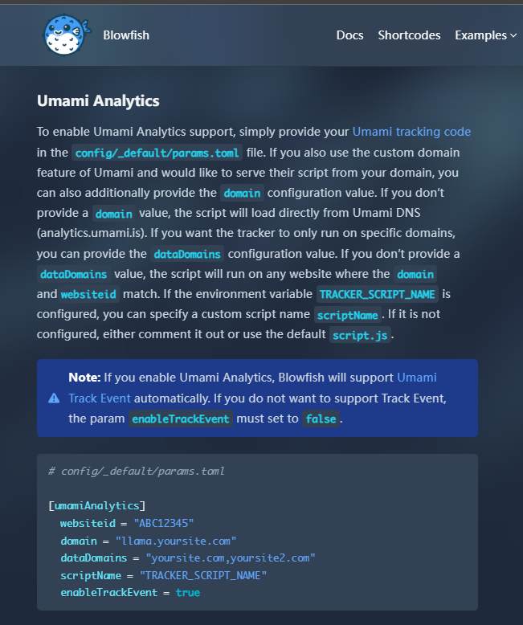
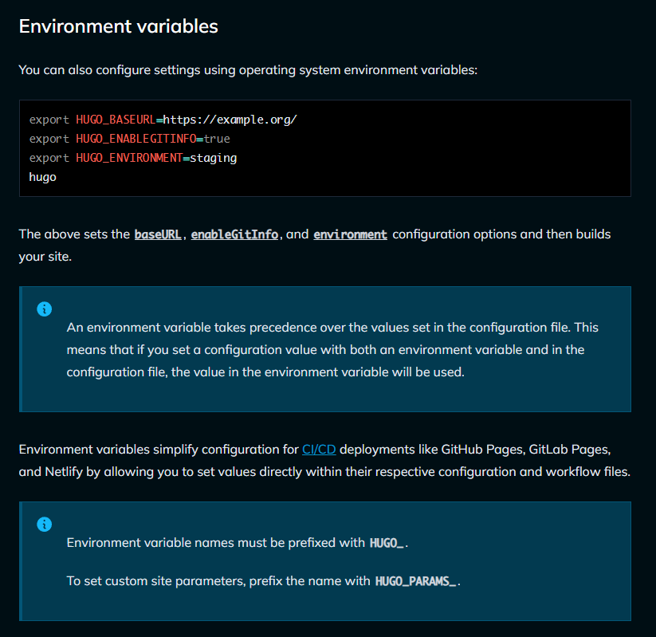
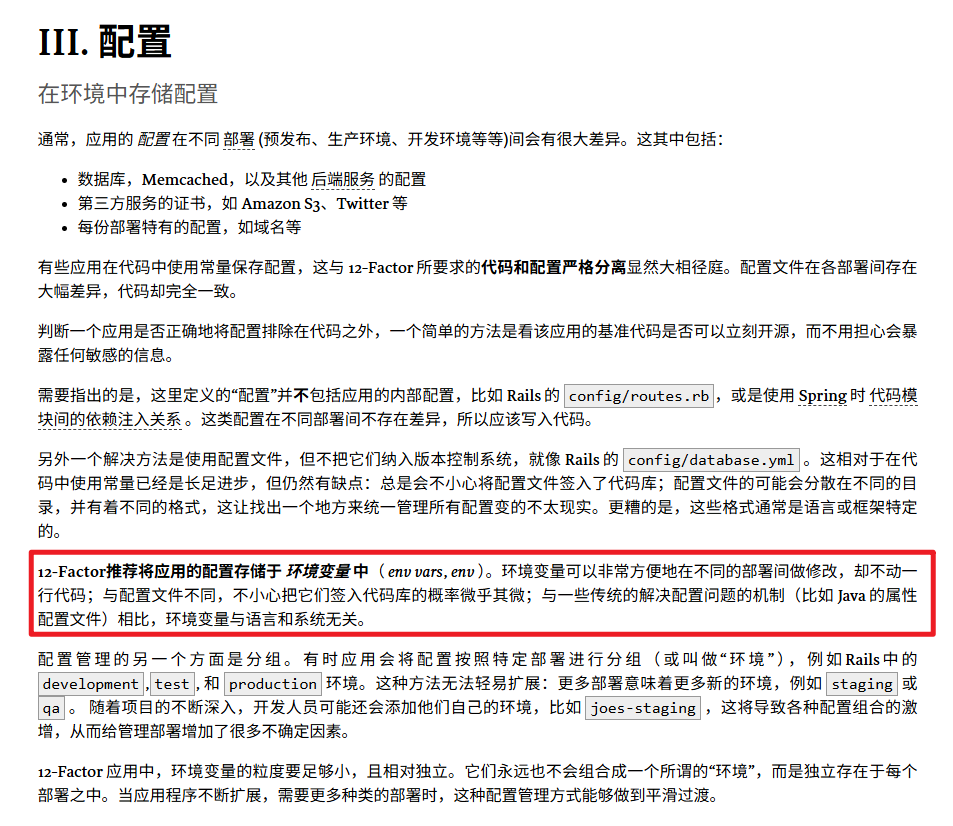

# 在hugo中使用环境变量填写配置

blowfish 是 hugo 的一个主题，在站点分析需求上，blowfish 内置支持 Fathom Analytics, Google Analytics 和 Umami Analytics。

在配置过程中，一开始我遇到了一些困惑：

以 umami 配置为例，

官网给的示例是在配置文件里面硬编码。

这让我感觉不太舒服，尽管我知道这些配置信息最后都会成为客户端的一部分，游客打开浏览器的开发者工具就可以看到 umami 插入的脚本以及我的配置信息，但我依然不愿意就这样硬编码在文件里面。

我开始寻找，是否存在一种方法可以在配置文件里面使用环境变量。

ai 给出的答案很幻觉，gemini2.5-pro 和 gpt5 都误以为 hugo 在模板系统中使用的 [getenv](https://gohugo.io/functions/os/getenv/) 可以用到配置文件里面。但实际上并没有，尝试了一些可能的在 toml 中使用变量的方案，也没有成功。

但我相信 hugo 不可能不支持环境变量。

经历一番搜索，终于在社区里面找到了一些蛛丝马迹：

https://github.com/gohugoio/hugo/issues/6276

https://gohugobrasil.netlify.app/getting-started/configuration/#environmental-variables

这下确认了，hugo 可以使用环境变量进行配置，而不必在配置文件里面硬编码。

但是搜素来搜索去好像怎么也没搜到官方说明。使用context7阅读官方文档，很快有结果了：

https://gohugo.io/configuration/introduction/#environment-variables

问题澄清，hugo 的确可以使用环境变量填写配置。

注意点：
- 环境变量字母全大写
- params参数要在HUGO前缀后面追加PARAMS
- 可以使用_或者x作为分隔符，如果变量名内含_，则必须用x

# 扩展阅读，关于“配置”

用环境变量直接做配置参数其实是一种工业界约定俗成的思路，

像 12factor 就明确提出：

在 hugo 中，也存在着**标准的配置参数查找顺序**：
1. 命令行参数
2. 环境变量
3. 配置文件（根目录）
4. 配置文件（config 目录）

知名的项目99%的可能会保证环境变量作为配置有效，如果没找到相关说明，可以考虑用 ai+context7 做语义化搜索，抑或是在社区中找关键词相关讨论。
